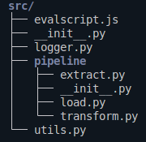

# Geospatial Software Engineer task @ Sinergise & Planet
This document presents my solutions for two technical tasks designed by Sinergise/Planet.

## Task 1: Dekadal NDVI Time Series Generation

### Requirements
- Python 3.12.3
- Sentinel Hub account

### Installation
Clone the repository into your working directory
```bash
git clone https://github.com/beltran99/sinergise-task.git
```

Navigate to the repository folder
```bash
cd sinergise-task
```

Create a new virtual environment called env
```bash
python3 -m venv env
```

Activate the virtual environment
```bash
source env/bin/activate # in Linux
.\env\Scripts\activate # in Windows
```

Installed the required packages in the virtual environment
```bash
python3 -m pip install -r requirements.txt
```

Write your Sentinel Hub account client credentials to [config.json](config.json).

### Usage
With the virtual environment activated, the pipeline can be run simply by calling [task1.py](task1.py) as a python module:
```bash
python3 -m task1
```
If no extra arguments are provided, the pipeline will be built and executed with the default parameters, which are:
- **AOI**: The provided [AOI](data/input/AOI_for_test.geojson) covering the city of Graz, Austria.
- **start**: 2025-08-01.
- **end**: 2025-08-31.
  
A path to an alternative AOI in GeoJSON format can be provided with the --aoi argument. The time interval of interest can also be parametrized, by using the arguments --start, and --end, to provide starting and ending dates in YYYY-MM-DD format, respectively. Additionally, the flag -v (or --verbose) can be set up to enable the program to produce verbose output. See the following example on how to add the CLI parameters:
```bash
python3 -m task1 --aoi data/input/myAOI.geojson --start 2025-01-01 --end 2025-09-30 -v
```

### Pipeline output
The resulting interpolated NDVI composite time series is written to disk in NetCDF and GeoTIFF formats in the [output](data/output/) directory. Additionally, a plot showing the NVDI evolution over time is generated.

### Code structure
The pipeline source code is structured as follows:



The backbone code can be found in the [pipeline](src/pipeline/) module, and it contains:
- [extract.py](src/pipeline/extract.py): Submodule for downloading data via the Sentinel Hub API.
- [transform.py](src/pipeline/transform.py): Submodule for transforming the raw data into the interpolated composite.
- [load.py](src/pipeline/load.py): Submodule for writing the resulting composite.

The remainder of the code is organised in helper submodules:
- [logger.py](src/logger.py): Provides the logging functionality.
- [utils.py](src/utils.py): Provides diverse functionalities to 

> [!NOTE]
> The [evalscript.js](src/evalscript.js) file contains the script passed as an argument in the Sentinel Hub requests and defines the data that will be retrieved.

## Task 2: BYOC Architecture Design
My solution to Task 2 can be found in the [task2.md](task2.md) file.