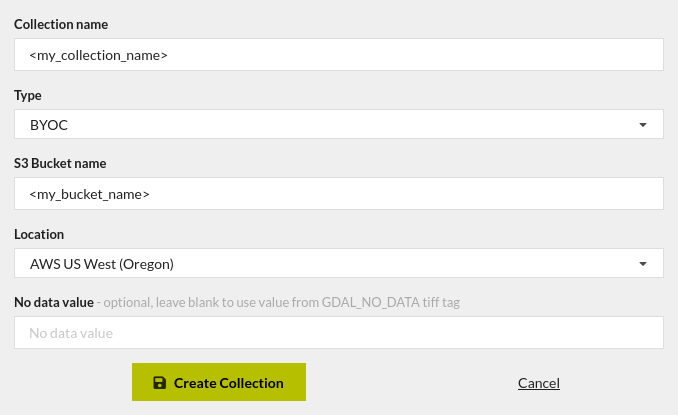
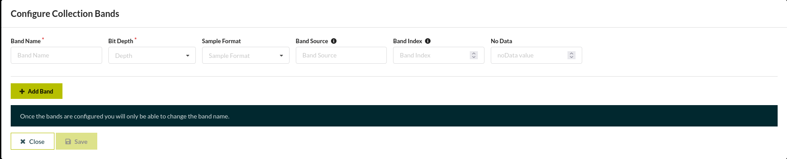
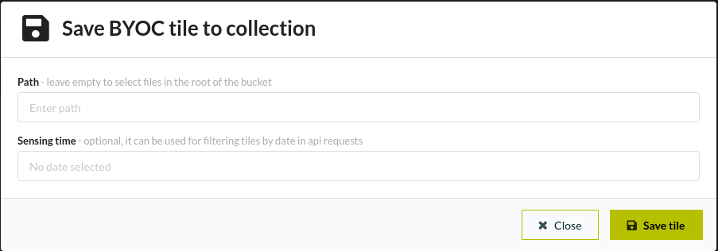

In order to make custom datasets available in the Copernicus data browser, the data can be onboarded via the Sentinel Hub "Bring Your Own COG" (BYOC) API. This document presents a detailed step-by-step guide on how to efficiently onboard your data. The following are the main steps described in this guide:
- [1. Configure s3 bucket](#1-configure-s3-bucket)
  - [Sync s3 to same region as BYOC](#sync-s3-to-same-region-as-byoc)
  - [Update bucket policy](#update-bucket-policy)
- [2. Convert images to the appropiate format](#2-convert-images-to-the-appropiate-format)
- [3. Create collection](#3-create-collection)
- [4. Ingest data into collection](#4-ingest-data-into-collection)

> [!NOTE]
> From now on, the placeholders <my_bucket_name> and <my_collection_name> will be used to respectively refer to your AWS S3 bucket name where your imagery is hosted, and to the BYOC API collection name, that we will create for onboarding your data.

# 1. Configure s3 bucket
## Sync s3 to same region as BYOC
The AWS s3 bucket containing the imagery needs to be in the same region as a BYOC deployment, i.e., either
- eu-central-1 (Frankfurt) for the EU region
- us-west-2 (Oregon) for the US region

In your case, the s3 bucket is already hosted in one of the supported regions. Note that, if your data were hosted in a bucket in a different region, the data would need to be synced into a new bucket in one of the supported regions.

## Update bucket policy
Now, you need to update the bucket policy in order to provide read access to Sentinel Hub. Updating a bucket policy can be very easily done via the Amazon AWS S3 console. In order to do so, you can follow the steps from this [tutorial](https://docs.aws.amazon.com/AmazonS3/latest/userguide/add-bucket-policy.html) and add the following policy:
```json
{
    "Version": "2012-10-17",
    "Statement": [
        {
            "Sid": "Sentinel Hub permissions",
            "Effect": "Allow",
            "Principal": {
                "AWS": "arn:aws:iam::ddf4c98b5e6647f0a246f0624c8341d9:root"
            },
            "Action": [
                "s3:GetBucketLocation",
                "s3:ListBucket",
                "s3:GetObject"
            ],
            "Resource": [
                "arn:aws:s3:::<my_bucket_name>",
                "arn:aws:s3:::<my_bucket_name>/*"
            ]
        }
    ]
}
```

# 2. Convert images to the appropiate format
The images in your bucket need to be stored in the Cloud Optimized GeoTIFF (COG) format. If your data is not in this format, you need to convert it. On top of that, there are a few [additional constraints](https://documentation.dataspace.copernicus.eu/APIs/SentinelHub/Byoc.html#constraints-and-settings) that must be met before ingestion into the BYOC collection.

With respect to the format conversion to COG, one of the most recommendable options is to use GDAL v3.1 (or newer). GDAL newer versions have native support for S3 thanks to vsis3, its virtual filesystem.

Firstly, make sure that GDAL can access your AWS credentials, e.g., via environment variables, or via a credentials file, stored in "C:\Users\username\\.aws\credentials" on Windows or "~/.aws/credentials" on Linux. If you need help to setup your AWS credentials, visit the following [tutorial](https://docs.aws.amazon.com/cli/v1/userguide/cli-chap-authentication.html). In the following, you can find an example of an AWS credentials file:
```
[default]
AWS_ACCESS_KEY_ID=<aws_access_key_id>
AWS_SECRET_ACCESS_KEY=<aws_secret_access_key>
```

GDAL command to print information about your files:
```bash
gdalinfo /vsis3/<my_bucket_name>/input_folder/image.tif
```

You can convert your files to COG format with the gdal_translate command and directly write the result in s3 as follows:
```bash
gdal_translate /vsis3/<my_bucket_name>/input_folder/image.tif /vsis3/<my_bucket_name>/output_folder/image_cog.tif
```

The conversion can be easily automated with a simple python or bash script, fetching all the images to convert. Note that, an error may occur when trying to write the converted image to s3. If you experience that error, you can give GDAL permission to write the file temporary before uploading it to s3, changing the value of the following environment variable:
```bash
export CPL_VSIL_USE_TEMP_FILE_FOR_RANDOM_WRITE=YES
```

# 3. Create collection
Once the s3 bucket has a suitable configuration, and the images have been converted to the right format, you can create your BYOC collection. Conceptually, a BYOC collection is a collections of tiles. Each tile needs to contain a set of bands and, optionally, an acquisition date and time.

There are two options for creating a collection, either through Sentinel Hub's Dashboard interface, or through the python API. The latter, provides better leverage if several collections need to be created, or the collections need to be updated often. However, in this guide, we will focus on the Dashboard interface, given its ease of use. For more information about how to use the python API, please check the following [example](https://sentinelhub-py.readthedocs.io/en/latest/examples/byoc_request.html#BYOC-collections).

You can easily create a new collection in the [My Collections](https://apps.sentinel-hub.com/dashboard/#/collections/collection/new) section of the Sentinel Hub Dashboard. You can use the configuration presented in the following screenshot:

The type of collection is BYOC, and the location must coincide with the region where your s3 bucket is hosted. Once the collection has been created, you can access it in the My Collections section of the Dashboard.

Optionally, you can configure the collection's bands to your convenience. If bands are not configured, the BYOC service will automatically configure them based on the files of the first ingested tile. If you wish to configure them manually, you can do so by accessing the newly created collection in the Dashboard:

The configurable parameters are:
- Band name: name of the band that you will use to query for this band in your evalscript. 
- Bit Depth: number of bits used to represent the possible values in the band.
- Sample Format: band data type. It can be set to signed integers, unsigned integers, or floating points.
- Band Source: file where the band is stored.
- Band Index: the index of the band in 1-based numbering.
- No Data: default value to be set when data is missing.

# 4. Ingest data into collection
Similarly to the previous step, the ingestion of tiles can be done intuitively through the Dashboard interface, or through the python API in bulk.

> [!WARNING]
> As described in the previous section, a BYOC collection is a group of tiles with the same bands. Therefore, when ingesting data into your collection, all tiles must contain the same set of files (they must share the same structure), or the ingest will fail.

In the case of the Dashboard, only one tile can be added at a time. To do so, you can browse your collection in the My Collections section, click on the Tiles subsection and, finally, click on the green " + Add tile " button. You will open the following dialog:

In the Path field, you must specify the path inside the s3 bucket where all COG files for this tile are stored. Optionally, you can also include the sensing time of the tile.

Since the archive has a size of 50TB, making use of the python Sentinel Hub API could be a more convenient way to ingest the tiles. In the following, there is a pseudocode of BYOC tile ingestion in python:
```python
# Setup sentinelhub configuration
SH_CLIENT_ID = "SH_CLIENT_ID"
SH_CLIENT_SECRET = "SH_CLIENT_SECRET"
config = SHConfig()
config.sh_client_id = SH_CLIENT_ID
config.sh_client_secret = SH_CLIENT_SECRET
config.save()

# Initialize SentinelHubBYOC class
byoc = SentinelHubBYOC(config=config)

# Obtain Collection Id from Sentinel Hub Dashboard
my_collection_id = "my_collection_id"
my_collection = byoc.get_collection(my_collection_id)

# Setup AWS client
AWS_ACCESS_KEY_ID = "AWS_ACCESS_KEY_ID"
AWS_SECRET_ACCESS_KEY = "AWS_SECRET_ACCESS_KEY"
client = boto3.client("s3", aws_access_key_id=AWS_ACCESS_KEY_ID, aws_secret_access_key=AWS_SECRET_ACCESS_KEY)

# Add tiles in bulk
# assumes each tile is located in a separate folder
bucket = "<my_bucket_name>"
result = client.list_objects(Bucket=bucket, Delimiter="/").get("CommonPrefixes")
for folder in result:
    folder = folder.get("Prefix")
    byoc_tile = ByocTile(path=folder)
    byoc.create_tile(my_collection, byoc_tile)
```